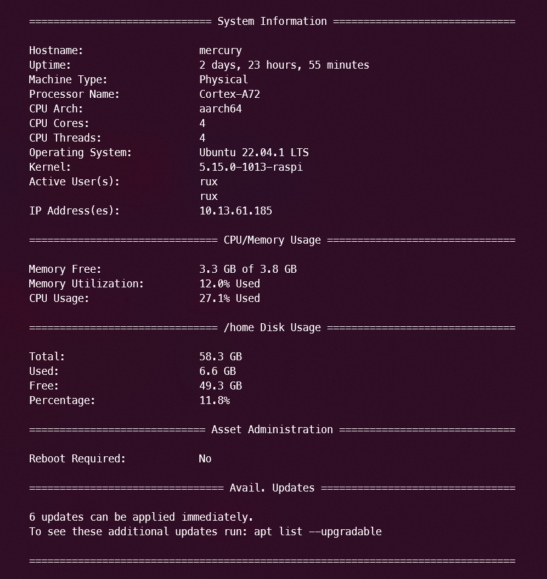

# sysinfo.py
A system info script based on Python, to poll info about a Linux-based system. Uses minimal imports not included in most major Linux Distros. 

## Dependencies 
`python3-psutil python3-cpuinfo`

`sudo cp /sys/class/dmi/id/product_serial /home/`
`sudo chown <username>: /home/product_serial`

## Raspberry Pi & Systems Without Some DMI Class Info
The sysinfo-raspi.py script is compatible with systems that do not have some dmi class information available. 

## TODO
 - Create a Python Script for use in Windows.  
